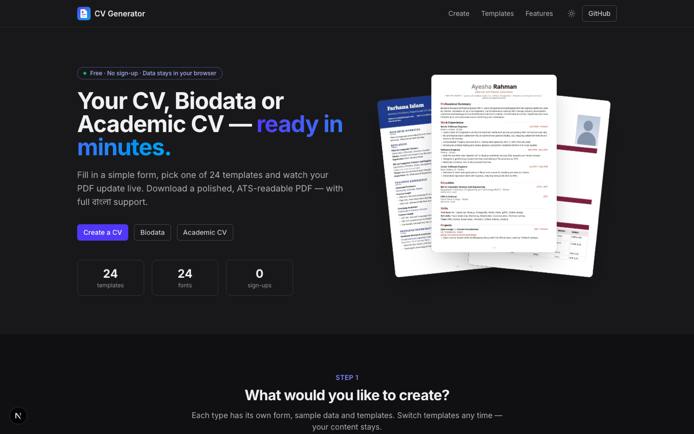
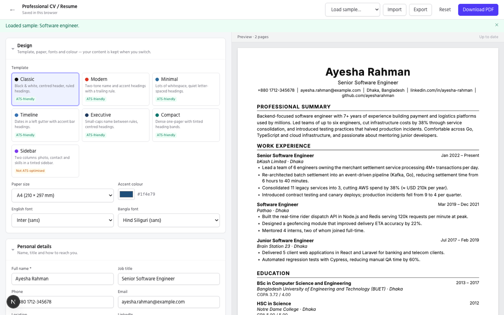
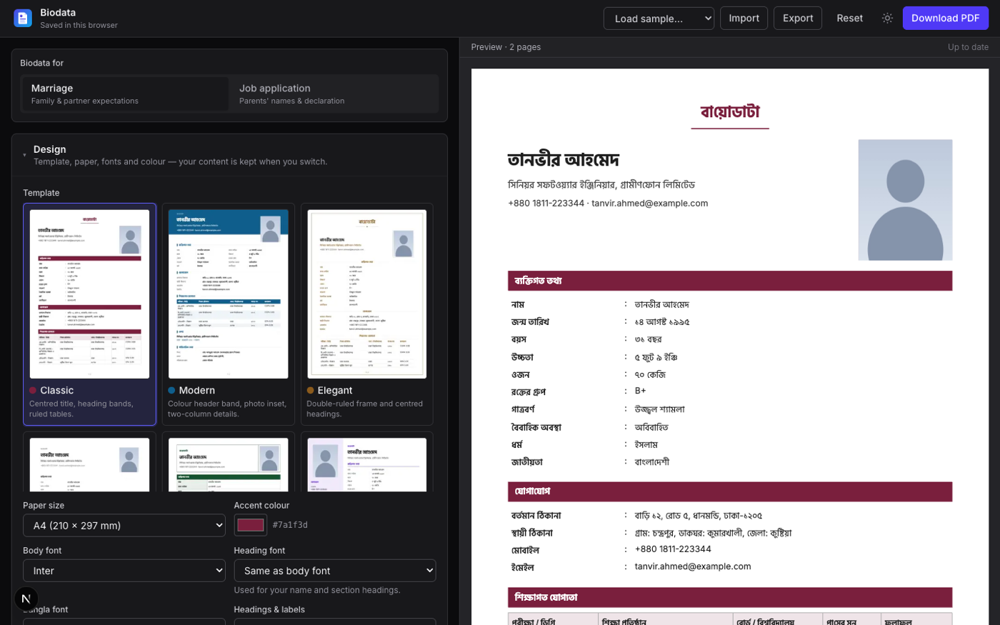
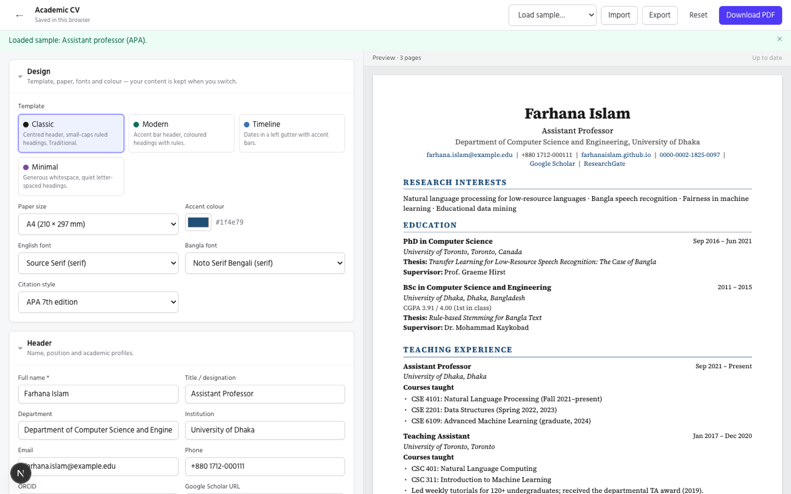

# CV Generator

Build a **Professional CV**, a **Europass CV**, a South Asian **Biodata** (marriage or job), an **Academic CV** or a Bangladeshi **Political CV** in the browser: fill in a form, watch the PDF update live, and download it. Text in the PDF is real, selectable text (ATS-readable), and Bangla (বাংলা) renders correctly.





| Biodata in Bangla | Academic CV |
| --- | --- |
|  |  |

## Features

- **Five document types and 42 templates**, each type with its own form and sample data:
  - **Professional CV (19 templates):** 9 of them ATS-friendly. Nine photo-led designs (round photo, coloured sidebars and bands, icon headings, timelines, language bars) show your initials when no photo is uploaded.
  - **Europass CV (6 templates):** the European CV structure, with the CEFR language self-assessment grid (A1–C2 for listening, reading, spoken production, spoken interaction and writing), EQF levels for education, digital skills, driving licence and categorised additional information. Dates print the European way (`08/2021 – Current`).
  - **Biodata (7 templates):** marriage/job mode, English or Bangla headings.
  - **Academic CV (7 templates):** APA 7 or IEEE citations, with your name bolded automatically in author lists.
  - **Political CV (3 templates):** a Bangladeshi party nomination CV (রাজনৈতিক জীবনবৃত্তান্ত) themed for **BNP**, **Awami League** or **Jamaat-e-Islami** (or any other party): party colours and the election symbol (sheaf of paddy, boat, scales), party position, seat sought, positions held, elections contested, movements, cases, education, profession, social work and a signed declaration. Headings in Bangla or English.
- **Live preview.** The PDF is re-rendered about 0.4 s after you stop typing and shown with pdf.js (it works on phones too). On mobile, Form and Preview are tabs.
- **Repeatable sections.** Add, remove and reorder entries by dragging or with the ↑/↓ buttons.
- **Section switches.** Any section can be hidden, and empty sections are never printed.
- **Switch template, fonts, paper size (A4 / US Letter) or accent colour** without re-entering anything. Template thumbnails appear on the home page and in the editor.
- **24 fonts in four categories** (sans-serif, serif, slab, monospace), including metric-compatible stand-ins for Calibri (Carlito) and Times New Roman (Tinos). You can use a **separate heading font**, e.g. Playfair Display headings with a Lato body, and pick one of **3 Bangla fonts**.
- **Dark theme by default**, with a light theme one click away. The choice is remembered.
- **Photo upload with cropping** to square or passport (35×45 mm) size.
- **Validation** with clear messages, e.g. a required name or an invalid email. Download is blocked until the fields shown in red are fixed. Errors in hidden sections are ignored.
- **Nothing leaves your browser.** Autosave goes to `localStorage`, and there is **Export/Import as JSON**.
- **Downloads are named** `Name_DocType_YYYY-MM-DD.pdf`, e.g. `Ayesha_Rahman_CV_2026-09-28.pdf`.

## Running it

Requires Node.js 20+.

```bash
npm install
npm run dev          # http://localhost:3000
```

| Command | What it does |
| --- | --- |
| `npm run dev` / `npm run build` / `npm start` | Next.js dev server / production build / serve the build |
| `npm test` | Unit tests (Vitest): date and citation formatting, file names, schemas, empty-section rules |
| `npm run typecheck` | `tsc --noEmit` |
| `npm run lint` | ESLint |
| `npm run render-samples [type]` | Renders every template with its sample data to `sample-output/*.pdf` (a quick visual check, no browser needed) |
| `npm run thumbnails` | Re-renders the samples and regenerates `public/templates/*.jpg` thumbnails (macOS only; uses PDFKit via Swift) |

`predev` / `prebuild` copy the pdf.js worker into `public/pdf.worker.min.mjs`. That file is generated, so it isn't committed.

## How it's organised

```
app/                        Home page and /editor/[type] (the editor runs client-side only)
components/
  editor/Editor.tsx         Toolbar, autosave, download, import/export, mobile tabs
  forms/                    Typed field components, SectionCard, SortableList, PhotoField
  forms/{professional,europass,biodata,academic,political}/   One form per document type
  preview/PdfPreview.tsx    Debounced render → pdf.js canvases
lib/
  schemas/                  Zod schemas + TypeScript types (shared pieces in common.ts)
  documents/                Empty documents, entry factories, prepare.ts (visibility rules), validation
  format/                   Dates, citations (APA/IEEE), file names
  pdf/                      Font registration, PDF generation
  storage/                  DocumentRepository interface, localStorage implementation, JSON import/export, migrations
  sample-data/              "Load sample" documents
templates/
  catalog.ts                Template names, descriptions and default colours (no react-pdf imports)
  registry.ts               Template id → component; renderDocument()
  shared/                   Kit: Section, Entry, Bullets, Rich text, PdfDocument
  {professional,europass,biodata,academic,political}/   The templates and each type's section renderers (blocks.tsx)
public/fonts/               TTF fonts (OFL, see LICENSE.md)
```

**Data model.** Every document has the same outer shape: `{ schemaVersion, type, settings, sections, data, updatedAt }`. `data` is the content, `settings` is presentation (template, paper, fonts, colour) and `sections` holds the on/off switches. Each schema is built twice from one definition ([lib/schemas/rules.ts](lib/schemas/rules.ts)):
- **Strict** is what the form enforces before download.
- **Draft** checks only the structure, so a half-finished document in `localStorage`, or an imported file, always loads.

**Templates only receive data.** [`prepare*()`](lib/documents/prepare.ts) removes empty entries and blank lines, and computes `show[section]`: switched on, allowed by the biodata mode, and non-empty. Templates render what they are given and never read the form.

**Adding a backend later.** Only [lib/storage/index.ts](lib/storage/index.ts) decides where documents live. Implement `DocumentRepository` (`load`, `save`, `remove`), for example with `fetch('/api/documents/…')`, and swap it in there.

## Adding a new template

1. **Create the component** in `templates/<type>/`, for example `templates/professional/Elegant.tsx`. It receives `{ doc }`, the prepared document, and returns a react-pdf `<Document>` via `PdfDocument`. The easiest start is to copy a similar template: define a `Kit` (styles, a `Heading` component, entry layout) and call the type's shared renderer:

   ```tsx
   export function Elegant({ doc }: { doc: PreparedProfessional }) {
     const kit: Kit = { s: baseKitStyles(palette, 10, { /* overrides */ }), Heading: ({ title }) => <Text>{title}</Text>, bulletChar: "•", entryLayout: "stacked", dateColumnWidth: 0 };
     return (
       <PdfDocument title={…} author={…} settings={doc.settings} pageStyle={{ padding: 40 }}>
         {/* your header */}
         {renderSections(kit, doc)}
       </PdfDocument>
     );
   }
   ```

   Biodata templates build a `BioKit` and call `renderBiodataSections`. Academic templates call `renderAcademicSections`, Europass templates `renderEuropassSections`, political templates `renderPoliticalSections` (with a `BioKit`).
2. **Register it** in [templates/registry.ts](templates/registry.ts) (`COMPONENTS[type][id]`).
3. **Describe it** in [templates/catalog.ts](templates/catalog.ts) with an id, name, description, `atsFriendly`, a default `accent` and optionally `inspiredBy`. It then appears in the template picker.
4. Run `npm run render-samples <type>` and check `sample-output/<type>-<id>.pdf`. Then run `npm run thumbnails` to create its picture for the home page and the template picker.

Rules that keep page breaks clean (see the comments in [templates/shared/kit.tsx](templates/shared/kit.tsx)):
- Render sections as **fragments, not wrapping `<View>`s**. react-pdf mis-paginates when an unbreakable block is the first child of a nested breakable view: it keeps the block on the page and squashes the text.
- Use `<Section>` and `<Entry>`. They keep each heading together with its first entry, and each entry head together with its first bullet.
- Don't use `letterSpacing` on Bangla text; it detaches vowel signs. The biodata templates use `tracking()` for this.
- Avoid double spaces and run boundaries without a space. react-pdf prints a "-" if it breaks a line there. User text is cleaned automatically (`collapseSpaces`), and citation runs are normalised (`normalizeSegments`).
- Use `headingFont(doc.settings)` for the name and section headings, so the heading-font setting applies.
- Photo-led designs can build on [templates/professional/photo/parts.tsx](templates/professional/photo/parts.tsx):
  - `Avatar` draws a round photo, or the initials when there's no photo.
  - `Icon`, `IconBadge` and the `Side*` blocks provide icons and compact sidebar sections.
  - `fitText` sizes names that sit inside fixed-height bands so they never overflow.
  - Set `featuresPhoto` (and optionally `fonts`) in the catalog.
- For a timeline, pass `rail` in the kit (a left border and a dot marker). Entries keep the line continuous without breaking pagination.

## Bangla support: a note on fonts

The spec asked for **Noto Sans Bengali**, but react-pdf's shaping engine (fontkit) renders many of its conjuncts wrongly (জন্ম, স্ত্রী, বিশ্ববিদ্যালয়, reph forms). This happens with both the Google Fonts and the upstream notofonts builds. The app therefore offers only Bangla fonts that were checked to shape correctly under react-pdf:
- **Hind Siliguri** (sans), the default
- **Mina** (sans)
- **Noto Serif Bengali** (serif)

Every template uses the font stack `[English font, Bangla font]`, so mixed Bangla and English text in any field renders with the right glyphs.

These fonts were tested and excluded:
- **Tiro Bangla** and **Baloo Da 2** crash the renderer.
- **Anek Bangla** drops the u-kar (ু).

## Template credits

The layouts are original react-pdf implementations, modelled on the look of these open-source CV designs:

| Template | Modelled on |
| --- | --- |
| Professional — Classic | [Jake's Resume](https://github.com/jakegut/resume) (MIT) |
| Professional / Academic — Modern | [Awesome-CV](https://github.com/posquit0/Awesome-CV) (LPPL 1.3c) |
| Professional / Academic — Timeline | [moderncv](https://github.com/moderncv/moderncv) "classic" style (LPPL) |
| Professional / Academic — Compact | [sb2nov/resume](https://github.com/sb2nov/resume) (MIT) |
| Professional / Biodata / Academic — Sidebar | [AltaCV](https://github.com/liantze/AltaCV) (LPPL) |
| Professional — Two-Column | [Deedy-Resume](https://github.com/deedy/Deedy-Resume) (Apache-2.0) |
| Professional — Engineering | [RenderCV](https://github.com/rendercv/rendercv) "engineeringresumes" theme (MIT) |
| Professional / Academic — Banner | [JSON Resume](https://jsonresume.org/themes/) "flat" theme (MIT) |
| Professional / Academic — Minimal | [JSON Resume](https://jsonresume.org/themes/) minimalist themes (MIT) |
| Professional — Executive, Academic — Classic | Harvard Office of Career Services résumé / CV guides |
| Biodata — Bordered | The traditional Bangladeshi office biodata form |
| Political — party symbols | Simple original drawings of the Election Commission symbols (sheaf of paddy, boat, scales); no party logos are bundled — users can upload their party's logo in the form |
| Europass — Classic, Modern | The structure of the [Europass CV](https://europass.europa.eu/) (traditional and current layouts); no Europass or EU logos are used, and the app is not affiliated with the European Union |
| Professional — Navy Sidebar, Pastel Split, Gray Column, Geometric, Photo Header, Diagonal, Soft Panel, Navy Header, Bold Pills | Original designs in the style of popular photo résumé layouts (dark or pastel sidebars, header bands, geometric accents); no third-party artwork is copied |

Fonts are licensed under the SIL Open Font License; see [public/fonts/LICENSE.md](public/fonts/LICENSE.md).

## Deploying to Vercel

The app is a static-friendly Next.js site with no backend, database or environment variables, so it deploys to Vercel as is:

1. Push the repository to GitHub (done).
2. On [vercel.com/new](https://vercel.com/new), import `MehrazRumman/cv-generator`. Keep the detected **Next.js** preset and the default build command (`npm run build`).
3. Deploy. `prebuild` copies the pdf.js worker automatically. PDFs are generated in the visitor's browser, so there are no serverless functions to size or pay for.

Every later push to `main` redeploys automatically.
